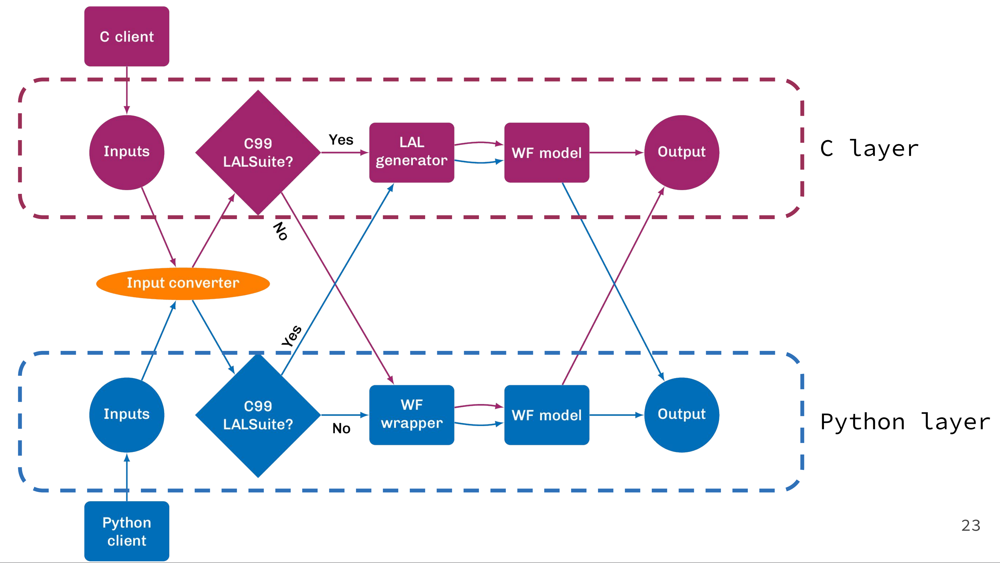

# Summary

Waveform models play a foundational role in gravitational waves (GW) astronomy, as they provide theoretical predictions of the GW signal in terms of the source properties, allowing us to extract physical information about the emitting source by comparing these templates to the GW signal registered by the detectors. LALSimulation is a software package within the LIGO-Algorithms Library (LALSuite) which provides a library of all the waveform models employed by the LIGO-Virgo-Kagra data analysis infrastructure. 

The new waveforms interface of LALSimulation allows to generate waveforms from models that are not implemented within LALSimulation and are implemented either in the C or Python languages. This eliminates the need of reimplementing the models in the C-99 language of LALSimulation. LALSimulation allows Python clients to access the waveforms implemented in C through SWIG wrappers. With the new interface, both the C and Python clients can generate both C and Python waveforms.

Python clients have additionally two possibilities to generate waveforms. One is keep using the traditional SWIG interface. The second is a new Python package called $\texttt{gwsignal}$ which provides additional functionalities and is more flexible than the SWIG interface. $\texttt{gwsignal}$ is integrated and released within LALSimulation.

The new waveforms interface facilitates a swift incorporation of new advancements in waveform modelling into the LVK infrastructure while providing a centralized and standardized framework for waveform generation from models internal and external to LALSimulation. Additionally, the new interface is backwards compatible with the old interface, meaning that all the LALSimulation routines can still be used and produce the exact same output as before. There is no need for clients to adapt to the new interface if they do not need extra functionalities.

# Statement of need

The continuous improvements in detector's sensitivity in each observing run translate into an exponential growth of detected events, increasing the volume of observed universe, and the probability of observing systems with new physics. In order to extract all the physical information from the detector data, waveform models need to model the subtle characteristic features that new physics imprint on the GW signal. The increased complexity in waveform morphology and the expanded parameter space that needs to be explored, leads to a much longer sampling time during parameter estimation, which added to the increase of detected events poses a tremendous computational challenge. There exists therefore, a continuous urge in the waveform modelling community to provide more accurate and more computationally efficient models that do not miss any relevant physical information from the data and that allow us to carry out all the analysis in an affordable timescale. These challenges will be exacerbated by the development of third-generation and space-based detectors which will lead to the dawn of precision gravitational wave astronomy.

In order to expedite the production of new waveform models and their incorporation into the LVK data analysis infrastructure, a more modern, versatile and flexible waveforms interface is needed. The LALSimulation package is written in the C-99 language, however sophisticated waveform models have been typically developed using high-level languages and software such as Mathematica or Python. Until now, LALSimulation required from the waveform developers the extra effort of implementing their models in the C language. The reimplementation of the model in a different, lower-level language and the subsequent review of this software supposed a daunting task for waveform modelers who often needed to learn C and spend their time rather as software engineers than as modellers. This additional step slows down the development of waveform models, but also prevents the incorporation in waveform models of more advanced tools not available in the C language, such as machine learning libraries, GPU support, etc. The Python language instead provides a rich ecosystem of cutting-edge libraries in a high-level language, which is simpler to use, easier to read, and seamlessly works across platforms. This has turned Python into a very popular and extended language in the scientific community. In the last years, many GW clients have also transitioned to use Python, leading to a plethora of GW Python packages in scenarios such as GW inference, GW analysis analysis (GWpy, Bilby, PESummary, Asimov), likelihood acceleration with ROQ models (PyROQ), searches pipelines (PyCBC, PyCWB), etc. GW models are also starting to be independently delivered and published as Python packages (surro, pyseobnr). 

The new LALSimulation waveform interface facilitates the incorporation of external Python models for their use in the centralized LVK pipelines without the need of a second reimplementation of the model in the C language. This represents the achievement of a paramount milestone, as it frees waveform developers from a enormous workload and allow them to exploit all the advanced tools and techniques provided by the Python language.

# Implementation

The new waveforms interface is divided in two layers: a C layer and a Python layer which determine how the waveform is generated, call the original waveform model code and then translate the output accordingly for the corresponding client. The figure sketches the functioning of each layer and the workflow for the waveform generation in different scenarios. Both layers work in a similar manner, only they are written in different languages. A new feature introduced by the new interface, is that allows the user to specify a flexible list of input parameters. Before, it required to pass a fixed list of arguments (mass components, cartesian spin components, etc). With the new routines, now one can specify multiple combinations of mass arguments (e.g. total mass and mass ratio) and specify the spins in polar coordinates passing a dictionary-like object. In each of the layers, the input arguments are internally converted into the a standardized list of parameters that will be used to generate the waveform. The waveform generator is a newly introduced object assigned to each waveform model, and comprises specific details about the model. This object determines for example the generating routines that each model supports and can optionally store metadata information about the physical effects that each model describes or their validity region. There exist currently four generating routines: time/Fourier domain polarizations and time/Fourier domain individual modes. These routines take as arguments the dictionary-like specifying the physical source parameters and the generator object mentioned above. If needed the output is transferred to the appropriate layer, meaning for example that C data types are translated to Python data types or viceversa.

Now we overview the four different scenarios one can find when using the new interface and explain in more detail the different paths depicted in the figure below. In the first scenario, we have a C client which decides to use a model implemented in C. In this scenario the workflow is similar to the old interface, everything is generated with C code, being the difference that the core waveform model code does not need to be implemented within LALSimulation.

Alternatively, the C client can call an external Python model, in this case the generator will create an instance of the Python interpreter and generate a Python waveform through embedded Python. The generated object is then transformed to C objects. Currently the Python output is generated as a GWpy Time/Frequency series which is then transformed to a LAL Time/Frequency series. The generator prevents from having to instantiate the Python interpreter in each waveform evaluation, since it is kept open as long as the generator object is not destroyed. This enables a more efficient evaluation when the model is called multiples times as in parameter estimation.

In the case that a Python client calls a C model, the generated C waveforms are available in Python through SWIG wrappers already present in the old LALSimulation. If the required model is instead a Python model, then everything is calculated within the Python layer and there is no need for any conversion of the output object. Example usages for each of these scenarios can be found #WHERE?

The only extra piece of work required from the waveform developers is to provide wrappers that interface the generating routines of the model with the methods that the generator expect to find. Templates and detailed instructions for writing these wrappers are available #WHERE? Call external C code from Python?

# Acknowledgements

